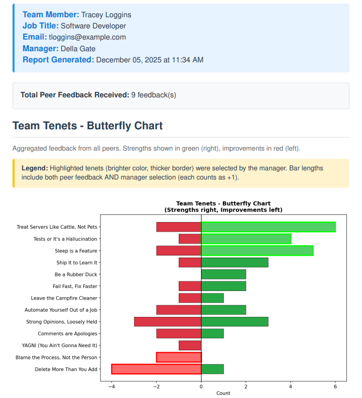

# Team Feedback Tool

A privacy-focused local web application for collecting and aggregating peer feedback based on team tenets.

## Overview

This tool enables teams to:
- **Individuals**: Provide structured feedback to colleagues using team tenets
- **Managers**: Aggregate anonymous peer feedback, add their own insights, and generate reports

All data stays local—no cloud sync, no external dependencies.



## Features

### For Individuals
- Select 3 tenet strengths and 2-3 areas for improvement for each colleague
- Two-column compact tenet layout for faster selection
- Auto-save with 2-second debounce (no manual save needed)
- Visual progress checklist (yellow → green when complete)
- Export feedback as CSV files (one per manager)
- Browser-based downloads (no server-side files)
- Support for external feedback providers (not in orgchart)

### For Managers
- One-time identity selection with session persistence
- Direct URL access: `http://localhost:5001/manager/[your-user-id]`
- Import feedback CSVs from team members
- Sortable team table (name, job title, feedback count)
- Butterfly chart visualization of aggregated peer feedback
- Highlight specific tenets for emphasis in reports
- Add manager's own feedback and comments
- Export PDF reports (browser print-to-PDF)
- Anonymous peer feedback display

## Quick Start

### 1. Generate Sample Data

Try the tool with fictitious data:

```bash
# Full demo setup: orgchart, peer feedback, manager feedback, export CSVs
python3 create_sample_feedback_data.py --demo

# Or for a larger organization (50 employees, 5 managers)
python3 create_sample_feedback_data.py --large --demo

# Start the app
python3 feedback_app.py
```

Access at: http://localhost:5001

Sample managers include: Della Gate (dgate), Rhoda Map (rmap), Kay P. Eye (keye), Agie Enda (aenda), Mai Stone (mstone)

### 2. Use with Real Data

```bash
# Start the application
python3 feedback_app.py
```

**Import your orgchart via Web UI** (Recommended):
1. Go to http://localhost:5001
2. Drag & drop your orgchart CSV onto the upload zone (or click to browse)

**Or via Command Line**:
```bash
python3 import_orgchart.py REAL-orgchart-export.csv
```

## Workflow

1. **Setup**: Import your orgchart CSV (drag & drop on home page)
2. **Individuals**: Give feedback for colleagues—select 3 strengths and 2-3 improvements per person, then export CSVs grouped by manager
3. **Managers**: Import feedback CSVs from your team, review aggregated reports, highlight key tenets, add your own feedback, and export PDFs

## Requirements

```bash
pip install flask sqlalchemy
```

Or install from requirements.txt:
```bash
pip install -r requirements.txt
```

## CSV Formats

### Orgchart Import Format

```csv
Name,User ID,Job Title,Location,Email,Manager UID
Paige Duty,pduty,Staff SRE,Boston MA,pduty@example.com,dgate
Della Gate,dgate,Engineering Manager,Raleigh NC,dgate@example.com,
```

### Feedback Export Format

```csv
From User ID,To User ID,Strengths (Tenet IDs),Improvements (Tenet IDs),Strengths Text,Improvements Text
pduty,llatency,"ownership,quality,collaboration","communication,innovation","Lee excels...","I see opportunities..."
```

## Tenets Configuration

The application looks for tenets in this order:
1. `tenets.json` (your organization's customized tenets)
2. `tenets-sample.json` (fallback with tech-themed examples)

To customize tenets for your organization:

```bash
# Copy the sample file
cp tenets-sample.json tenets.json

# Edit tenets.json with your organization's values
# (This file is in .gitignore, so it stays private)
```

Tenet format:

```json
{
  "tenets": [
    {
      "id": "ownership",
      "name": "Ownership & Accountability",
      "description": "Takes responsibility for outcomes",
      "active": true
    }
  ]
}
```

Set `"active": false` to temporarily disable a tenet without deleting it.

## Architecture

- **Flask**: Web framework (port 5001)
- **SQLAlchemy**: ORM for database operations
- **SQLite**: Local database (feedback.db)
- **Jinja2**: Template engine
- **Chart.js**: Butterfly chart visualizations
- **Vanilla JavaScript**: No frameworks, simple and maintainable

### Database Schema

**persons**: Imported from orgchart
- user_id (PK), name, job_title, location, email, manager_uid (FK)

**feedback**: Peer feedback entries
- id (PK), from_user_id (FK), to_user_id (FK)
- strengths (JSON array of tenet IDs)
- improvements (JSON array of tenet IDs)
- strengths_text, improvements_text

**manager_feedback**: Manager's feedback
- id (PK), manager_uid (FK), team_member_uid (FK)
- selected_strengths, selected_improvements (JSON arrays)
- feedback_text

## Privacy & Security

- **Local-first**: All data stays on your machine
- **No authentication**: Designed for single-user local execution
- **No telemetry**: No external API calls or cloud sync
- **Anonymous peer feedback**: Manager reports don't show who gave feedback
- **CSV includes provider ID**: For accountability during collection
- **.gitignore**: Protects REAL-*.csv, feedback.db, tenets.json

## Development

### Project Structure

```
.
├── feedback_app.py              # Flask application
├── feedback_models.py           # SQLAlchemy models
├── import_orgchart.py           # CSV import utility
├── create_sample_feedback_data.py  # Sample data generator
├── feedback_templates/          # Jinja2 templates
│   ├── base.html
│   ├── index.html
│   ├── individual_feedback.html
│   ├── manager_select.html
│   ├── manager_dashboard.html
│   ├── export_list.html
│   └── report.html
├── tenets-sample.json           # Sample tenets configuration
├── FEEDBACK_QUICKSTART.md       # Quick reference guide
└── README.md                    # This file
```

### Auto-Save Pattern

Used consistently across the application:
- 2-second debounce on all changes
- Visual "✓ Saved" indicator
- Silent error handling (logs to console)
- No manual save buttons or popups

### UI Patterns

- **Two-column layout**: Compact tenet selectors
- **Sortable tables**: Click headers to sort (↑↓)
- **Context banners**: Show current user/manager identity
- **Progress indicators**: Checklist with yellow → green states
- **Inline editing**: No separate forms or modals

## Troubleshooting

**Port conflict**
- Feedback tool uses port 5001
- Change in feedback_app.py if needed: `app.run(port=5002)`

**No managers found**
- Make sure orgchart CSV has people with direct reports
- Managers are auto-detected (people referenced in Manager UID column)

**Auto-save not working**
- Check browser console for errors
- Verify JavaScript is enabled
- Try hard refresh: Ctrl+Shift+R

**Butterfly chart not rendering**
- Check browser console for JavaScript errors
- Verify Chart.js CDN is accessible
- Try clearing browser cache

**Database locked**
- Close any other processes using feedback.db
- Restart the Flask app

## Contributing

This tool was developed with AI assistance (Claude Code by Anthropic) to accelerate development while maintaining code quality.

## License

MIT License - See LICENSE file for details

## Acknowledgments

- Sample employee names are tech-themed puns for demo purposes
- Butterfly chart pattern adapted from performance analytics tools
- Built with Flask, SQLAlchemy, and Chart.js
