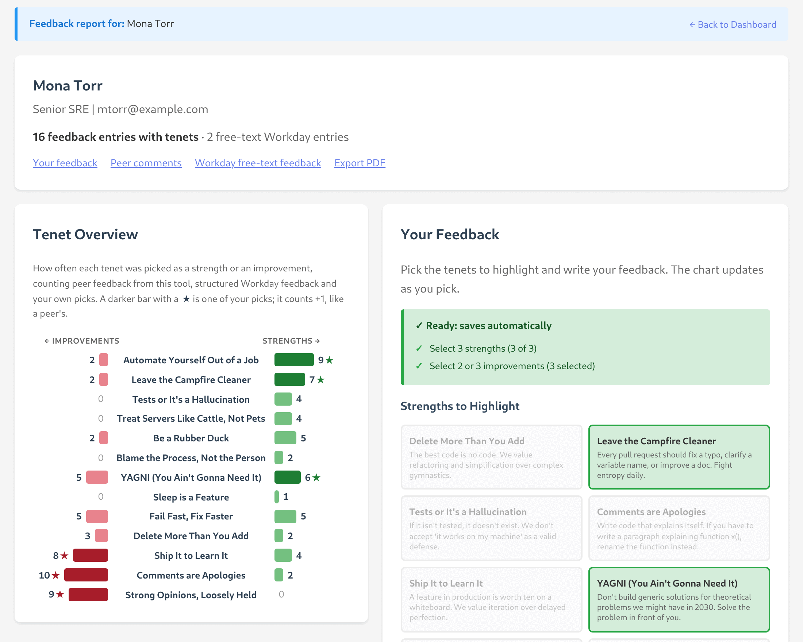
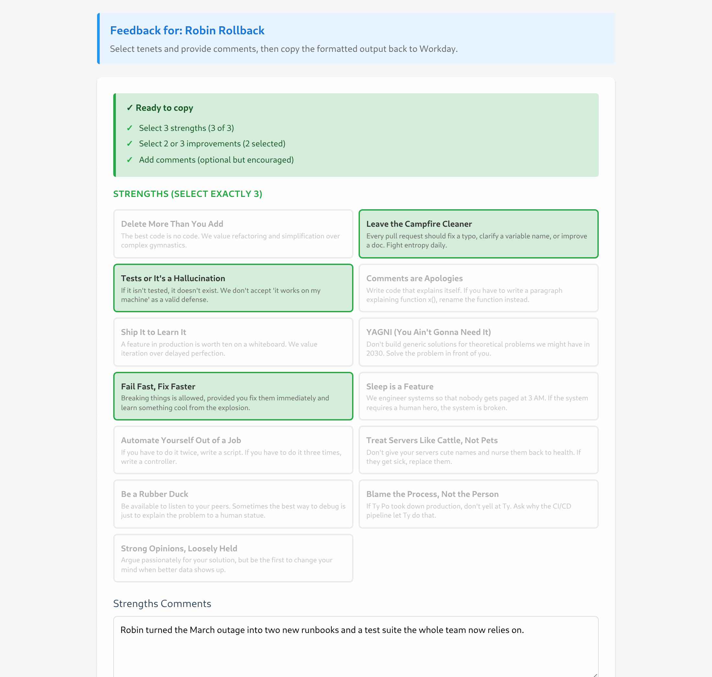
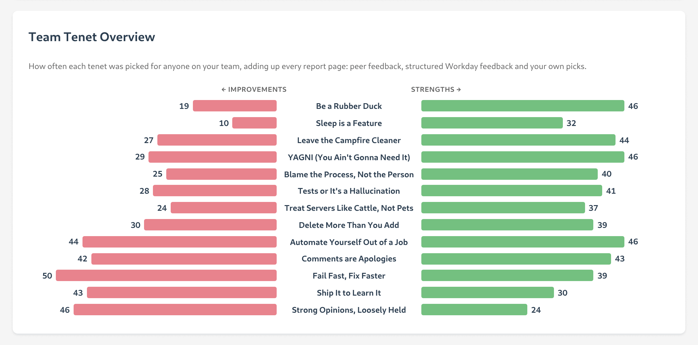
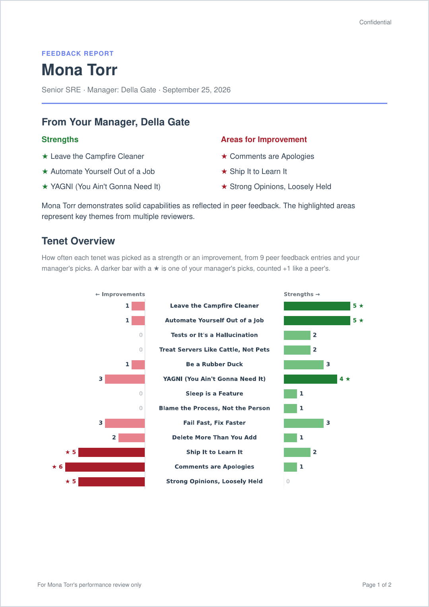

# Team Feedback Tool

Structured peer feedback, built around your team's values.

Colleagues pick the **tenets** (your team's values) where someone shines and
where they could grow, add comments, and paste the result into Workday.
Managers import that feedback and see, for each person and for the whole
team, how often each tenet came up. They add their own picks and words, and
hand each person a one-page PDF.

It runs on your own computer. Nothing is sent anywhere.



## Try It in Two Minutes

Demo mode runs locally with fictitious sample data (the people are tech puns
like Paige Duty and Robin Rollback):

```bash
git clone https://github.com/adereis/team-feedback-tool.git
cd team-feedback-tool
python3 -m venv .venv && source .venv/bin/activate
pip install -r requirements.txt
python3 scripts/create_demo_template.py
python3 app.py
```

Open http://localhost:5001/demo, choose **Manager Dashboard**, pick Della
Gate, and open anyone's report. Each browser gets its own copy of the sample
data; **Reset demo data** in the banner restores it.

## What It Does

### Giving feedback

Pick exactly 3 strengths and 2 or 3 areas for improvement from your team's
tenets, and explain them in your own words. **Copy for Workday** turns it into
text you paste into Workday; the tool reads it back when your manager imports
the Workday export. In the local app your work saves automatically.



### Writing a manager's report

- Import the "Feedback on My Team" XLSX export from Workday.
- For each person, see how often every tenet was picked as a strength or an
  improvement, and read the comments behind the picks.
- Highlight your own 3 strengths and 2 or 3 improvements, which count in the
  chart like a peer's, and write your feedback.
- Copy your feedback back to Workday, and export a PDF for the team member.

The dashboard adds everyone's reports into one chart, so you can see what
your whole team is strong at and where it could grow:



### The PDF for the team member

The PDF opens with the manager's picks and words, then shows the tenet chart
and the peer comments, **without the names of the peers who wrote them**.
Feedback imported from Workday is left out, since some of it may not be
visible to the team member.



## Using It for Real

### Install and run

You need Python 3.9 or later. PDF export uses [WeasyPrint], which needs the
Pango library (on Fedora: `sudo dnf install pango`).

```bash
./run.sh          # macOS/Linux
run.bat           # Windows
```

The script creates a virtual environment on first run, installs the
dependencies and opens http://localhost:5001. Your data is kept in
`feedback.db` next to the code.

To try the local workflow with sample data, including a real XLSX import,
run `python3 scripts/create_sample_data.py --demo`. It fills `feedback.db`
with fictitious people and writes a sample Workday export to `samples/`.

[WeasyPrint]: https://doc.courtbouillon.org/weasyprint/stable/first_steps.html

### Set your tenets

The tool ships with example tenets (`samples/tenets-sample.json`). To use your
team's own, copy the file to `tenets.json` and edit it. `tenets.json` is in
`.gitignore`, so it stays private.

```bash
cp samples/tenets-sample.json tenets.json
```

```json
{
  "tenets": [
    {
      "id": "ownership",
      "name": "Ownership & Accountability",
      "category": "Delivery",
      "description": "Takes responsibility for outcomes",
      "active": true
    }
  ]
}
```

Set `"active": false` to hide a tenet without deleting it.

### Import your team (optional)

With an orgchart, people pick their name from a list, and managers see their
direct reports. Drop the CSV onto the home page, or run
`python3 scripts/import_orgchart.py orgchart.csv`:

```csv
Name,User ID,Job Title,Location,Email,Manager UID
Della Gate,dgate,Engineering Manager,Raleigh NC,dgate@example.com,
Paige Duty,pduty,Staff SRE,Boston MA,pduty@example.com,dgate
```

Leave **Manager UID** empty for top-level managers. **Location** is optional.
Without an orgchart, managers enter their name and their team comes from the
Workday import.

### The Workday workflow

1. **Request**: a manager or employee requests feedback in Workday and
   includes a link that names the recipient, such as
   `http://localhost:5001/feedback?for=Robin%20Rollback`.
2. **Give**: each provider runs the tool, opens the link, picks tenets, writes
   comments, and pastes the **Copy for Workday** text into Workday.
3. **Import**: the manager downloads the "Feedback on My Team" XLSX from
   Workday and drops it on the Manager Dashboard.
4. **Report**: the manager reviews each person, adds their own picks and
   words, copies them back to Workday, and exports the PDF.

Feedback written with this tool carries a `[TENETS]` marker, so its picks
count in the charts. Free-text feedback from other Workday requests is shown
on the report but not counted.

## Privacy

This is a helper next to your HR system, not a place to keep employee data.

- **Workday stays the source of truth.** Feedback goes into Workday by copy
  and paste, and managers import it from Workday's own export.
- **Everything stays on your machine.** There is no cloud sync, no telemetry
  and no external request, not even for scripts or fonts in the browser.
- **Each person runs their own copy.** There are no accounts; the tool is
  meant for one person on their own computer.
- **The database is disposable.** Delete `feedback.db` after a review cycle.
- **Peers stay anonymous to the team member.** The manager's report page
  shows who wrote each comment; the PDF does not.
- `.gitignore` covers `feedback.db`, `tenets.json` and `REAL-*` exports, so
  real data is not committed by accident.

## Deployment (Hosted Mode)

Besides local use, the tool can run as a shared web service:

| Mode | How | For | Data |
|------|-----|-----|------|
| **Local** (default) | `python3 app.py` | Preparing feedback and reports on your computer | `feedback.db`, kept |
| **Demo** | open `/demo` | Exploring with fictitious data | One sandbox per browser |
| **Hosted** | `HOSTED_MODE=true` | The `/feedback?for=Name` form, plus demo | None stored |

In hosted mode the local pages (`/individual`, `/manager`) are blocked, and a
`SECRET_KEY` shared by all workers is required to sign session cookies:

```bash
export SECRET_KEY=$(python3 -c 'import secrets; print(secrets.token_hex(32))')
HOSTED_MODE=true python3 app.py
```

In a container (Podman/Docker, OpenShift):

```bash
podman build -t team-feedback .
podman run -p 8080:8080 -e SECRET_KEY="$SECRET_KEY" team-feedback

oc new-app --strategy=docker --binary --name=team-feedback
oc start-build team-feedback --from-dir=. --follow
oc create secret generic team-feedback --from-literal=SECRET_KEY="$SECRET_KEY"
oc set env deployment/team-feedback --from=secret/team-feedback
oc expose svc/team-feedback --name=demo
oc patch route demo -p '{"spec":{"tls":{"termination":"edge","insecureEdgeTerminationPolicy":"Redirect"}}}'
```

The image sets `HOSTED_MODE=true` and builds the demo database.

## Troubleshooting

**Port 5001 is in use**: another copy may be running. Stop it, or change the
port in the last line of `app.py`.

**"Database is locked"**: run only one copy of the tool at a time, then
restart it.

**The Workday import fails**: it needs the "Feedback on My Team" export.
Column names are mapped in `workday_config.json`.

**No tenets appear**: check that `tenets.json` is valid JSON, or delete it to
fall back to the sample tenets.

**PDF export fails**: install WeasyPrint's system libraries (see above).

## Development

Run the tests with `pytest`; see `tests/TESTING.md`. Architecture, patterns
and conventions for contributors (human or AI) are in [AGENTS.md](AGENTS.md).
The tool is built with Flask, SQLAlchemy, SQLite, vanilla JavaScript and
WeasyPrint, and was developed with AI assistance (Claude Code by Anthropic).

## License

MIT License. See [LICENSE](LICENSE).
